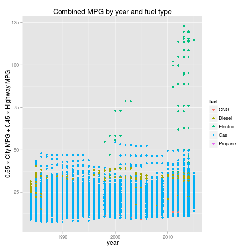

Fueleconomy Slidify App
========================================================
author: Chris Little
date: June 21, 2015
transition: rotate
font-import: http://fonts.googleapis.com/css?family=Raleway
font-family: 'Raleway'

EPA fuel economy data
========================================================

The US Environmental Protection Agency (EPA) publishes
fuel economy data on all vehicles sold in the US.

This data is collected in the CRAN fueleconomy dataset
and incorporates information about each car, such as:

- Year, make, model
- Vehicle class, fuel type
- Transmission, drive train, & other engine information
- City & highway MPG

Fueleconomy Slidify App
========================================================


But this data is difficult to wade through and visualize.

Enter the [Fueleconomy Slidify App](https://chrislit.shinyapps.io/fueleconomy).

The Fueleconomy Slidify App presents MPG data for the cars in the fueleconomy
set as a function of their model year, and plots the values in an attractive
graph that indicates each vehicle's fuel type.

Example Fueleconomy Slidify plot
========================================================
 

Fine-tuning options
========================================================
Further, the Fueleconomy Slidify Plot allows you to adjust the combined MPG formula (55% city MPG, 45% highway MPG by default).

The 2014 Ford Taurus gets 32 Hwy/22 Cty MPG, or, a combined MPG of:

```r
fev[13204,]$hwy*0.45 + fev[13204,]$cty*0.55
```

```
[1] 26.5
```

The app also permits selection of a subset of years and a subset of vehicle types, for users who want more control.
